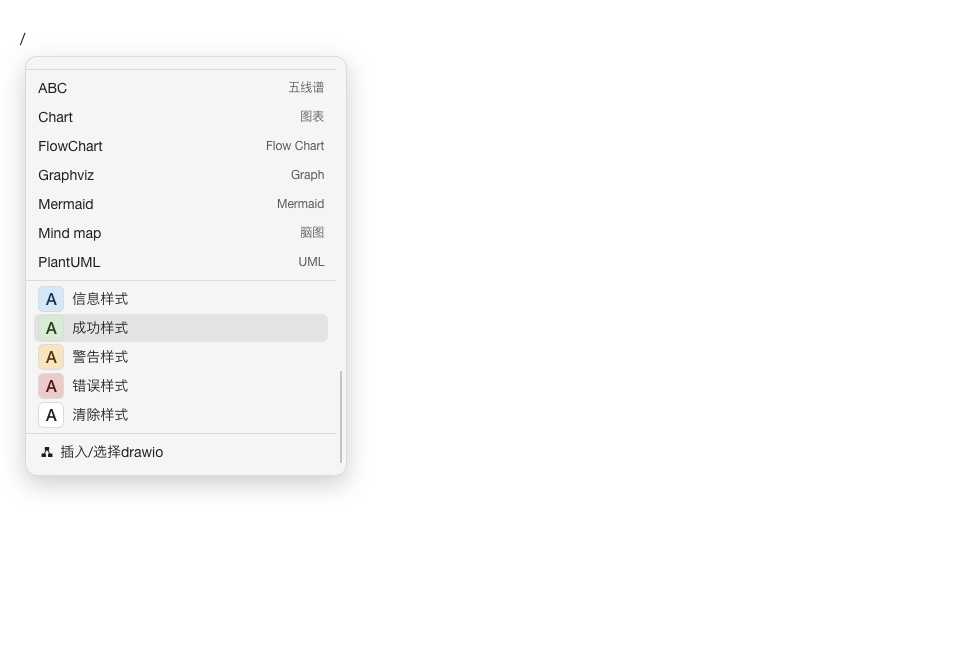
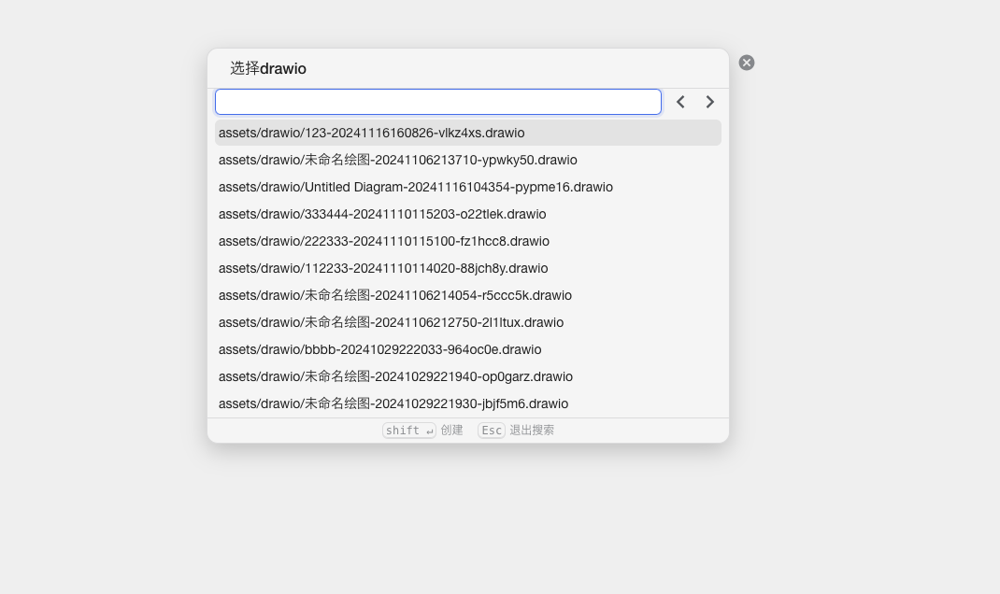
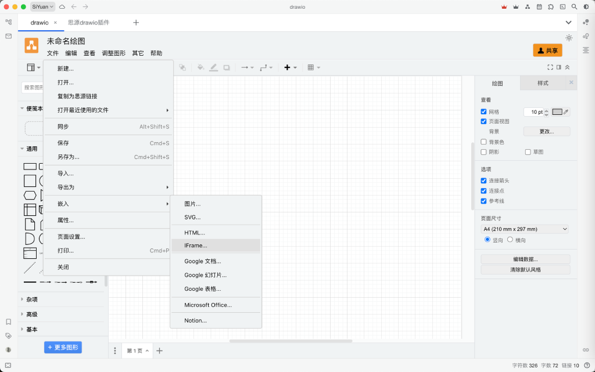

# Siyuan Draw.io Plugin

[中文](README_zh_CN.md) | [English](README.md)

## Description
Integrated into Siyuan as a plugin

### Usage

In edit mode, type `/drawio`, select and insert it into the note.

## Author
cowboy

## Preview

## Version
0.1.31

## Changelog
- **v0.1.31 (2025-04-27)**
  - Fixed a bug where uploading would create duplicates
- **v0.1.30 (2025-04-07)**
  - Fixed a bug where uploading would create duplicates
- **v0.1.29 (2025-03-28)**
  - Added harmony platform support
- **v0.1.28 (2025-03-18)**
  - Added upload feature to dock bar
- **v0.1.27 (2025-03-07)**
  - Added sorting feature to dock bar and set default save path to `storage/petal/siyuan-drawio-plugin/`
- **v0.1.26 (2025-03-04)**
  - Added auto-save feature and optimized the display of file management buttons.
- **v0.1.25 (2025-02-27)**
  - Added dock bar on the left side with features like rename, delete, and copy.
- **v0.1.24 (2025-02-17)**
  - Added drawio icon to tabs.
- **v0.1.23 (2025-02-08)**
  - Added support for saving outside the drawio folder.
- **v0.1.21 (2024-12-11)**
  - Added full-screen mode
- **v0.1.20 (2024-12-10)**
  - Fixed an issue where files with only spaces in their names would cause an error due to being undetectable.
- **v0.1.19 (2024-12-4)**
  - Updated draw.io version to v25.0.2
- **v0.1.18 (2024-11-26)**
  - Added support for PlantUML
- **v0.1.17 (2024-11-26)**
  - Added theme simple/sketch
- **v0.1.16 (2024-11-26)**
  - Added the **Copy as Image** feature
- **v0.1.15 (2024-11-25)**
  - Modified file loading method to reduce changes to drawio
- **v0.1.14 (2024-11-16)**
  - Removed offline mode.
- **v0.1.13 (2024-11-16)**
  - Added a refresh button in lightbox mode.
- **v0.1.12 (2024-11-16)**
  - The `/` command will automatically insert `drawio` as an `iframe` into the note, and add the `data-assets` attribute to resolve the issue of unreferenced resource files.
  - Removed the 'Copy as Siyuan Link' menu in drawio.
- **v0.1.11 (2024-11-05)**
  - Optimized the logic for adding new tabs and the `/` command to insert `drawio`.
- **v0.1.9 (2024-10-31)**
  - Fixed the issue with the popup for creating new files.
- **v0.1.8 (2024-10-31)**
  - Fixed the error with the `path` package in the browser environment.
- **v0.1.7 (2024-10-30)**
  - Fixed the issue where the `/` command popup would not show.
- **v0.1.6 (2024-10-29)**
  - Optimized file opening logic and updated tab titles.

## Minimum App Version
3.0.12

## Supported Backends
- windows
- linux
- darwin
- docker
- ios
- android

## Supported Frontends
- desktop
- mobile
- browser-desktop
- browser-mobile
- desktop-window

## Keywords
- plugin
- drawio

## Donation List

- ONIONLYONE ￥20
- 凌风 ￥10
- Manfred ￥10