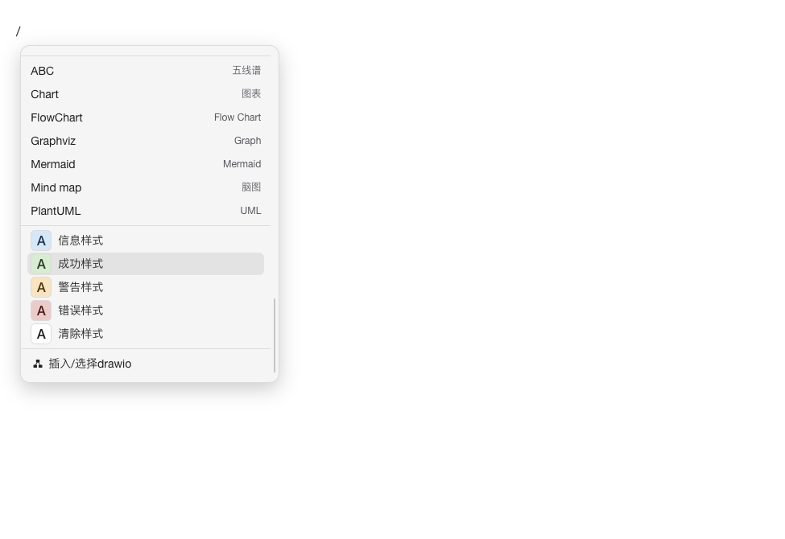
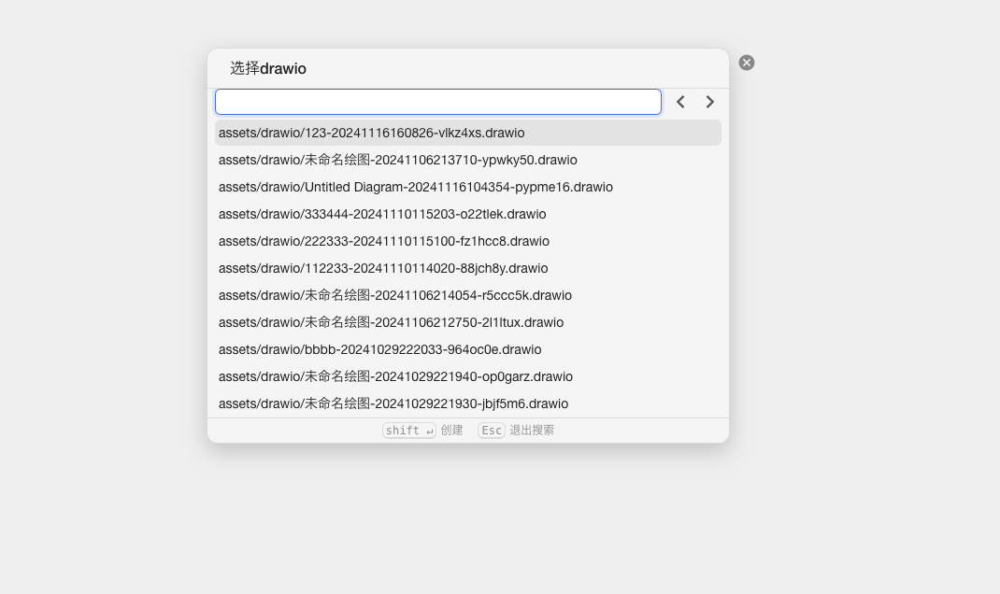

# 思源Draw.io插件

[中文](README_zh_CN.md) | [English](README.md)

## 描述
以插件形式集成到思源中

### 使用方法

编辑状态下输入`/drawio`, 选择并插入到笔记中

## 作者
cowboy

## 预览

## 版本
0.1.25

## 更新日志
- **v0.1.25 (2025-02-27)**
  - 左侧增加 dock 栏，增加重命名、删除、复制等功能
- **v0.1.24 (2025-02-17)**
  - 页签增加 drawio 图标
- **v0.1.23 (2025-02-08)**
  - 支持非drawio文件夹下的保存
- **v0.1.22 (2025-01-21)**
  - 保存和恢复配置
- **v0.1.21 (2024-12-11)**
  - 增加全屏模式
- **v0.1.20 (2024-12-10)**
  - 修复文件是空格的情况下找不到文件的报错
- **v0.1.19 (2024-12-4)**
  - 更新 draw.io 版本到 v25.0.2
- **v0.1.18 (2024-11-26)**
  - 增加plantuml支持
- **v0.1.17 (2024-11-26)**
  - 增加主题 simple/sketch
- **v0.1.16 (2024-11-26)**
  - 增加【复制为图片】功能
- **v0.1.15 (2024-11-25)**
  - 修改文件加载方式，减少对drawio的改动
- **v0.1.14 (2024-11-16)**
  - 移除离线模式
- **v0.1.13 (2024-11-16)**
  - 灯箱模式下增加刷新按钮
- **v0.1.12 (2024-11-16)**
  - `/`命令会自动将`drawio`以`iframe`形式插入到笔记中，同时增加`data-assets`属性，解决未引用资源文件问题
  - 移除了drawio中『复制为思源链接』菜单
- **v0.1.11 (2024-11-05)**
  - 优化新增Tab逻辑和`/`命令插入`drawio`逻辑
- **v0.1.9 (2024-10-31)**
  - 修复文件->新建的弹窗问题
- **v0.1.8 (2024-10-31)**
  - 修复`path`包在浏览器环境报错的问题
- **v0.1.7 (2024-10-30)**
  - 修复`/`命令弹窗无法报错的问题
- **v0.1.6 (2024-10-29)**
  - 优化文件打开逻辑并更新标签标题

## 最低应用版本
3.0.12

## 支持的后端
- windows
- linux
- darwin
- docker
- ios
- android

## 支持的前端
- desktop
- mobile
- browser-desktop
- browser-mobile
- desktop-window

## 关键词
- plugin
- drawio

# ❤️用爱发电
如果喜欢我的插件，欢迎给GitHub仓库点star和捐赠，这会激励我继续完善此插件和开发新插件。

## 赞赏榜

- ONIONLYONE ￥20
- 凌风 ￥10
- Manfred ￥10